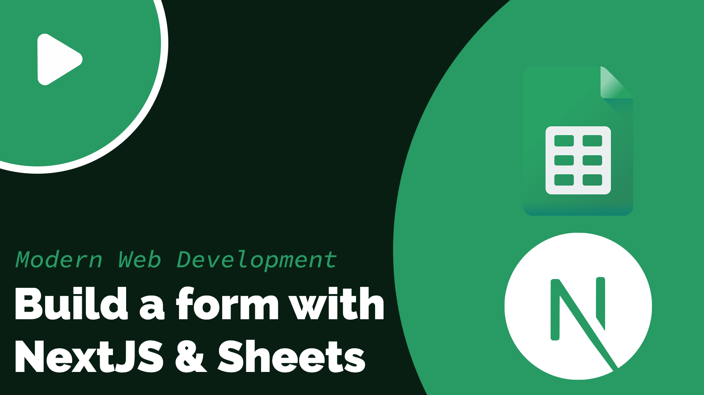
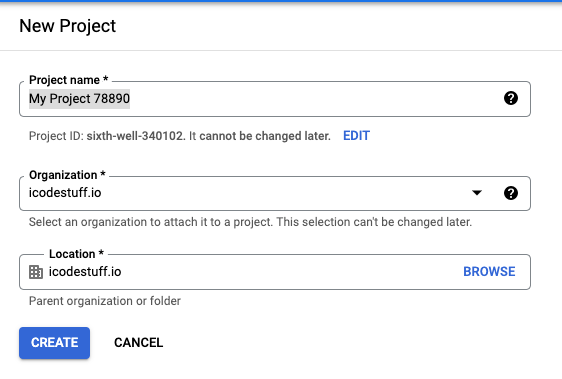
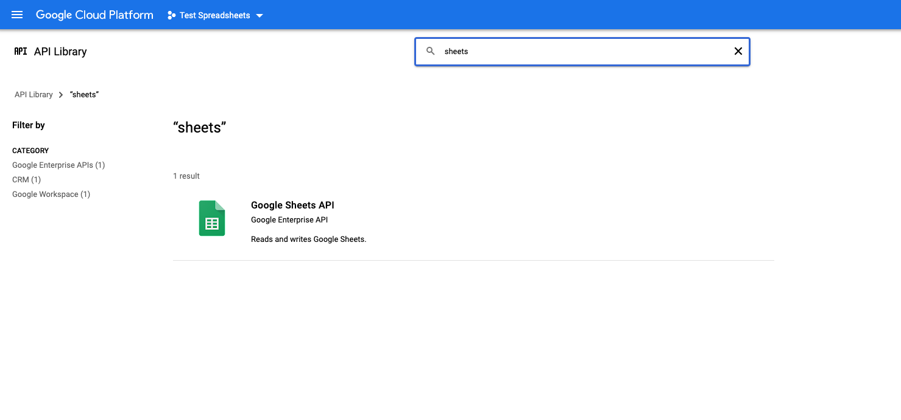
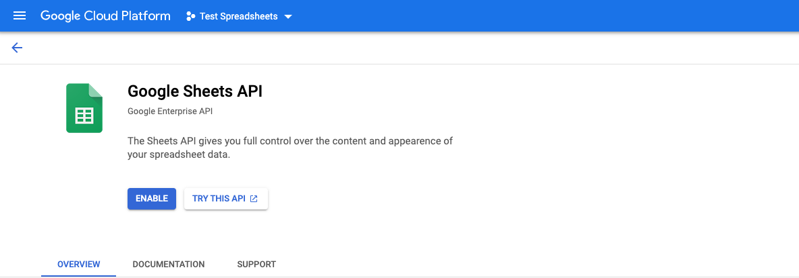
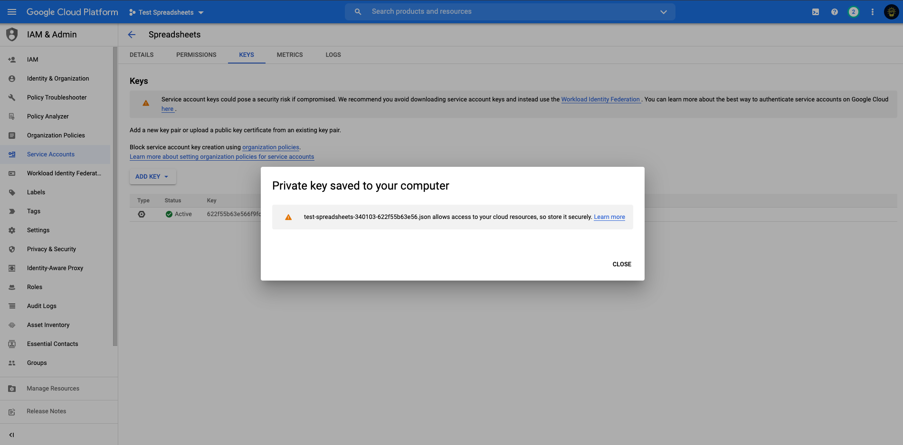
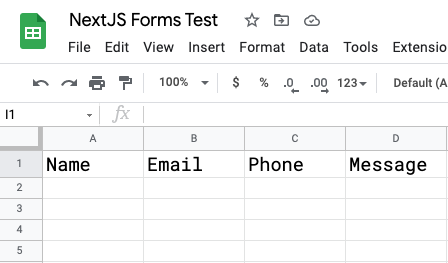

In this tutorial, learn how to build a form that save records into Google Sheets using NextJS & TailwindCSS.

## Google Setup

### Google Cloud

We want to login or register an account for [Google Cloud](https://console.cloud.google.com/), then create a new project like so:



Go to the APIs & Services page and click the `ENABLE APIS AND SERVICES` button then search for sheets



The click Enable



After you’ve enable the Google Sheets API, then click the Credentials on the left navigation. Then click your service account and add a new key using the JSON option like so:



After you download the json file, copy the `private_key` and `client_email` as they will later be using in the env file

### Google Sheets

Next, we want to setup our [Google Sheet](https://docs.google.com/spreadsheets) and add the Name, Email, Phone & Message as columns like so:



Then make the Google Sheet public.

## Setup our project

### Setup NextJS

Next, we will want to create our NextJS project by using the following command:

```bash
$ npx create-next-app nextjs-sheets-form --typescript
```

### Setup TailwindCSS

Install TailwindCSS by running the following:

```bash
$ npm install -D tailwindcss postcss autoprefixer @tailwindcss/forms
$ npx tailwindcss init -p
```

Next, go to your `tailwind.config.js` file and add the following:

```jsx
module.exports = {
    content: [
        "./pages/**/*.{js,ts,jsx,tsx}",
        "./components/**/*.{js,ts,jsx,tsx}",
    ],
    theme: {
        extend: {}
    },
    plugins: [
        require('@tailwindcss/forms')
    ],
}
```

Lastly update you `styles/global.css` file with the following:

```css
@tailwind base;
@tailwind components;
@tailwind utilities;
```

### Update .env

Next, let’s setup our `.env.local` file then add the following values.

```
GOOGLE_CLIENT_EMAIL=
GOOGLE_PRIVATE_KEY=
GOOGLE_SHEET_ID=
```

The `GOOGLE_PRIVATE_KEY` is the API key you created earlier while the `GOOGLE_CLIENT_EMAIL` is the primary email for your Google Cloud account and the `GOOGLE_SHEET_ID` is the Spreadsheet ID available in the URL.

### Add Google API

Next we want to install the Google API package by using the following command:

```bash
$ npm i googleapis
```

## Code our project

Now that our project is setup with the necessary packages, we want to design our form using TailwindCSS

### Update Index File

```tsx
import type { NextPage } from 'next'
import {FormEvent, useState} from "react";

const Home: NextPage = () => {
    const [name, setName] = useState('');
    const [email, setEmail] = useState('');
    const [phone, setPhone] = useState('');
    const [message, setMessage] = useState('');

    const handleSubmit = async (e: FormEvent<HTMLFormElement>) => {
        e.preventDefault();

        let form = {
            name,
            email,
            phone,
            message
        }

        const rawResponse = await fetch('/api/submit', {
            method: 'POST',
            headers: {
                'Accept': 'application/json',
                'Content-Type': 'application/json'
            },
            body: JSON.stringify(form)
        });
        const content = await rawResponse.json();

        // print to screen
        alert(content.data.tableRange)

        // Reset the form fields
        setMessage('')
        setPhone('')
        setName('')
        setEmail('')
    }

    return (
        <main className="bg-gray-100 min-h-screen">
            <div className="max-w-5xl mx-auto py-16">
                <form className="py-4 space-y-4" onSubmit={handleSubmit}>
                    <div className="flex items-center justify-center">
                        <label htmlFor="name" className="sr-only">Name</label>
                        <input value={name} onChange={e => setName(e.target.value)} type="text" name="name" id="name" className="shadow-md focus:ring-indigo-500 focus:border-indigo-500 block w-64 sm:text-md border-gray-300 rounded-md" placeholder="Your Name" />
                    </div>
                    <div className="flex items-center justify-center">
                        <label htmlFor="email" className="sr-only">Email</label>
                        <input value={email} onChange={e => setEmail(e.target.value)} type="email" name="email" id="email" className="shadow-md focus:ring-indigo-500 focus:border-indigo-500 block w-64 sm:text-md border-gray-300 rounded-md" placeholder="Your Email" />
                    </div>
                    <div className="flex items-center justify-center">
                        <label htmlFor="phone" className="sr-only">Phone</label>
                        <input value={phone} onChange={e => setPhone(e.target.value)} type="tel" name="phone" id="phone" className="shadow-md focus:ring-indigo-500 focus:border-indigo-500 block w-64 sm:text-md border-gray-300 rounded-md" placeholder="Your Phone" />
                    </div>
                    <div className="flex items-center justify-center">
                        <label htmlFor="message" className="sr-only">Message</label>
                        <textarea value={message} onChange={e => setMessage(e.target.value)} id="message" className="shadow-md focus:ring-indigo-500 focus:border-indigo-500 block w-64 sm:text-md border-gray-300 rounded-md" placeholder="Your Message" />
                    </div>
                    <div className="flex items-center justify-center">
                        <button type="submit" className="flex items-center justify-center text-sm w-64 rounded-md shadow py-3 px-2 text-white bg-indigo-600">Save</button>
                    </div>
                </form>
            </div>
        </main>
    )
}

export default Home
```

### Setup API Endpoint

Next, we want to setup our API endpoint to update our Google Sheet. Create a file called `api/submit.ts` and add the following code:

```tsx
import type { NextApiRequest, NextApiResponse } from 'next'
import {google} from "googleapis";

type SheetForm = {
    name: string
    email: string
    phone: string
    message: string
}

export default async function handler(
    req: NextApiRequest,
    res: NextApiResponse
) {
    if (req.method !== 'POST') {
        return res.status(405).send({ message: 'Only POST requests allowed' })
    }

    const body = req.body as SheetForm

    try {
        const auth = new google.auth.GoogleAuth({
            credentials: {
                client_email: process.env.GOOGLE_CLIENT_EMAIL,
                private_key: process.env.GOOGLE_PRIVATE_KEY?.replace(/\\n/g, '\n')
            },
            scopes: [
                'https://www.googleapis.com/auth/drive',
                'https://www.googleapis.com/auth/drive.file',
                'https://www.googleapis.com/auth/spreadsheets'
            ]
        })

        const sheets = google.sheets({
            auth,
            version: 'v4'
        });

        const response = await sheets.spreadsheets.values.append({
            spreadsheetId: process.env.GOOGLE_SHEET_ID,
            range: 'A1:D1',
            valueInputOption: 'USER_ENTERED',
            requestBody: {
                values: [
                    [body.name, body.email, body.phone, body.message]
                ]
            }
        });

        return res.status(201).json({
            data: response.data
        })
    }catch (e) {
        return res.status(e.code).send({message: e.message})
    }

}
```
